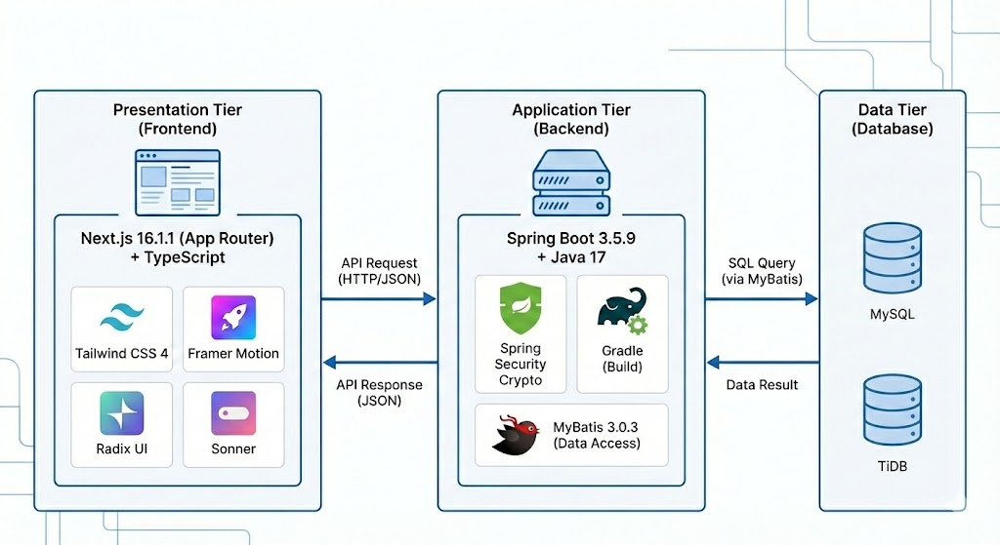

# FABRIO

B2B 구매 관리 ERP 시스템으로 구매사(Buyer)와 협력사(Vendor) 간의 구매 프로세스를 효율적으로 관리합니다.

구매요청(PR) → 견적요청(RFQ) → 발주(PO) → 입고(GR)의 전체 구매 워크플로우를 지원합니다.

## 🎯 프로젝트 목표

| 목표                       | 설명                                               |
| -------------------------- | -------------------------------------------------- |
| **실무 프로세스 반영**     | 실제 구매 업무 흐름을 벤치마킹하여 설계            |
| **상태 코드 기반 전환**    | 문서 상태(PROGRESS_CD)에 따른 단계별 프로세스 제어 |
| **Role + Owner 권한 정책** | 역할 기반 접근 제어와 문서 담당자 기반 수정 권한   |
| **확장 가능한 구조**       | 모듈화된 설계로 향후 기능 확장 용이                |

## 👥 팀 구성

| 팀원       | 담당 영역                                   |
| ---------- | ------------------------------------------- |
| **윤소연** | 프로세스 구조, DB 설계, 견적관리, 공통 모듈 |
| **송민선** | 구매관리, MyPage, Git 전략                  |
| **이재민** | 발주관리, 재고관리, 프론트 UI               |
| **최진현** | 기준정보, 회원가입, 개발 환경 설정          |

## 📋 프로세스 흐름


### 프로세스 단계

| 역할           | 주요 업무                              |
| -------------- | -------------------------------------- |
| 기준정보관리자 | 품목 마스터, 협력사 마스터 등록        |
| 구매요청부서   | 구매요청(PR) 생성                      |
| 구매팀         | RFQ 생성, 협력사 선정, 발주서(PO) 작성 |
| 협력사         | 견적서 제출, 발주 수신 확인, 물품 납품 |
| 자재팀/입고    | 입고 검수 및 처리, 재고 반영           |

## 🎯 유스케이스


### 주요 기능

#### 구매사 (Buyer)

- 기준정보 관리 (품목, 협력사 마스터)
- 구매요청 (PR) 생성 및 승인
- 견적요청 (RFQ) 생성 및 협력사 선정
- 발주서 (PO) 작성 및 전송
- 입고 (GR) 처리

#### 협력사 (Vendor)

- 견적서 제출
- 발주 수신 확인
- 납품 처리

## 🔁 문서 상태 전이


### 상태 코드 (PROGRESS_CD)

| 코드 | 명칭 | 설명                 |
| ---- | ---- | -------------------- |
| T    | 저장 | 임시 저장            |
| D    | 확정 | 확정                 |
| A    | 승인 | 승인                 |
| R    | 반려 | 반려 (반려사유 필수) |
| S    | 전송 | 협력사 전송          |
| C    | 완료 | 납품 완료            |
| E    | 종결 | 종결                 |

## 🖥️ 메뉴 구조


## 🛠️ 기술 스택


### Backend

- **Spring Boot** 3.5.9
- **Java** 17
- **Gradle**
- **MySQL**
- **MyBatis** 3.0.3
- **Spring Security Crypto**

### Frontend

- **Next.js** 16.1.1 (App Router)
- **TypeScript**
- **Tailwind CSS** 4
- **Framer Motion**
- **Radix UI**
- **Sonner**

## 🏗️ 시스템 아키텍처



## 📡 API 명세서

자세한 API 명세는 아래 Postman 문서를 참고하세요:

🔗 **[API Documentation (Postman)](https://documenter.getpostman.com/view/31677176/2sBXVk9obN)**

## 📁 프로젝트 구조

### Backend

```
src/main/java/com/company/erp/
├── common/              # 공통 유틸리티 및 설정
│   ├── auth/           # @RequireRole 애너테이션 (RBAC)
│   ├── config/         # 파일, 비밀번호, WebMvc 설정
│   ├── docNum/         # 자동 문서번호 생성 (PR-YYYYMMDD-001)
│   ├── exception/      # ApiResponse 래퍼, GlobalExceptionHandler
│   ├── file/           # 파일 업로드/다운로드 (로컬 스토리지)
│   ├── login/          # 세션 기반 인증
│   ├── session/        # SessionInterceptor, @SessionIgnore
│   └── signup/         # 협력사 가입 승인 워크플로우
├── master/             # 마스터 데이터 관리
│   ├── category/       # 품목 카테고리
│   ├── item/           # 품목 마스터
│   ├── vendor/         # 협력사 관리
│   └── vendoruser/     # 협력사 사용자 관리
├── pr/                 # 구매요청
├── rfq/                # 견적요청
├── po/                 # 발주
├── inventory/          # 입고
├── mypage/             # 사용자 프로필 관리
└── notice/             # 공지사항
```

### Frontend

```
frontend/
├── app/                # Next.js App Router 페이지
├── components/         # 재사용 UI 컴포넌트
├── lib/                # 유틸리티, API 클라이언트
└── types/              # TypeScript 타입 정의
```

## 🔐 인증 및 권한

### 세션 기반 인증

- `JSESSIONID` 쿠키 사용
- `@SessionIgnore` 애너테이션으로 세션 검사 우회 (login/signup API)
- `SessionInterceptor`로 모든 요청 검증
- 세션 타임아웃: 30분

### 역할 기반 접근 제어

- `@RequireRole("BUYER")` 애너테이션
- 역할: `ADMIN`, `BUYER`, `USER`, `VENDOR`
- `comType`으로 구매사(B) vs 협력사(V) 구분

## 📝 환경 변수

| 변수                       | 설명                 | 기본값                                   |
| -------------------------- | -------------------- | ---------------------------------------- |
| `APP_CORS_ALLOWED_ORIGINS` | CORS 허용 오리진     | `http://localhost:3000`                  |
| `DB_HOST`                  | MySQL 호스트         | (필수)                                   |
| `DB_PORT`                  | MySQL 포트           | (필수)                                   |
| `DB_ID`                    | MySQL 사용자명       | (필수)                                   |
| `DB_PW`                    | MySQL 비밀번호       | (필수)                                   |
| `APP_FILE_BASE_DIR`        | 파일 업로드 디렉토리 | `C:/upload/erp`                          |
| `APP_FILE_MAX_SIZE_BYTES`  | 최대 파일 크기       | `10485760` (10MB)                        |
| `APP_FILE_ALLOWED_EXT`     | 허용 파일 확장자     | `jpg,jpeg,png,pdf,xlsx,xls,doc,docx,zip` |
| `APP_CRYPTO_KEY`           | 비밀번호 암호화 키   | (필수)                                   |

## ⚙️ 비즈니스 규칙

1. **협력사 등록 플로우**: 신규 협력사는 `approvalStatus='P'`(대기) 상태로 가입. 관리자 승인 후 로그인 가능.

2. **PR → RFQ → PO → GR 워크플로우**:
   - PR 승인 후 RFQ 생성 가능
   - RFQ를 협력사에 전송하고 협력사를 선정한 후 PO 생성 가능
   - PO를 협력사에 전송하고 협력사 확인(`checkFlag='Y'`) 후 GR 처리 가능

3. **문서번호 자동 생성**: `DocNumService`가 문서 유형별 시퀀스를 관리하며 일일 리셋 기능 지원.

4. **파일 첨부**: 파일은 `refType`(PR/PO/VN)과 `refNum`(문서번호)으로 문서와 연결.

## 🗄️ 테이블 구조

| 모듈               | 테이블                               | 설명                              |
| ------------------ | ------------------------------------ | --------------------------------- |
| **구매요청 (PR)**  | `PRHD`, `PRDT`                       | 구매요청 헤더/상세                |
| **견적요청 (RFQ)** | `RFQHD`, `RFQDT`, `RFQVN`, `RFQVNDT` | 견적요청 헤더/상세, 협력사별 견적 |
| **발주 (PO)**      | `POHD`, `PODT`                       | 발주 헤더/상세                    |
| **입고 (GR)**      | `GRHD`, `GRDT`                       | 입고 헤더/상세                    |

### 공통 컬럼

| 컬럼명         | 설명                          |
| -------------- | ----------------------------- |
| `PROGRESS_CD`  | 문서 진행 상태 코드           |
| `CTRL_USER_ID` | 문서 담당자 (Owner 권한 기준) |
| `REG_DATE`     | 등록일시                      |
| `MOD_DATE`     | 수정일시                      |

## 🔧 공통 모듈

| 모듈               | 설명                                                          |
| ------------------ | ------------------------------------------------------------- |
| **문서번호 채번**  | PR / RFQ / PO / GR 문서번호 자동 생성 (예: `PR-20260122-001`) |
| **권한 처리**      | `@RequireRole` 애너테이션 기반 역할별 접근 제어               |
| **상태 코드 관리** | `PROGRESS_CD` 기반 문서 상태 전이 제어                        |
| **세션 관리**      | `SessionInterceptor` 기반 인증 처리                           |

## 🚀 향후 확장 계획

- 📬 **알림 기능**: 문서 상태 변경 시 담당자 알림
- 📜 **이력 관리**: 문서 변경 이력 추적
- 🏢 **다중 구매사 관리**: 멀티 테넌트 지원
